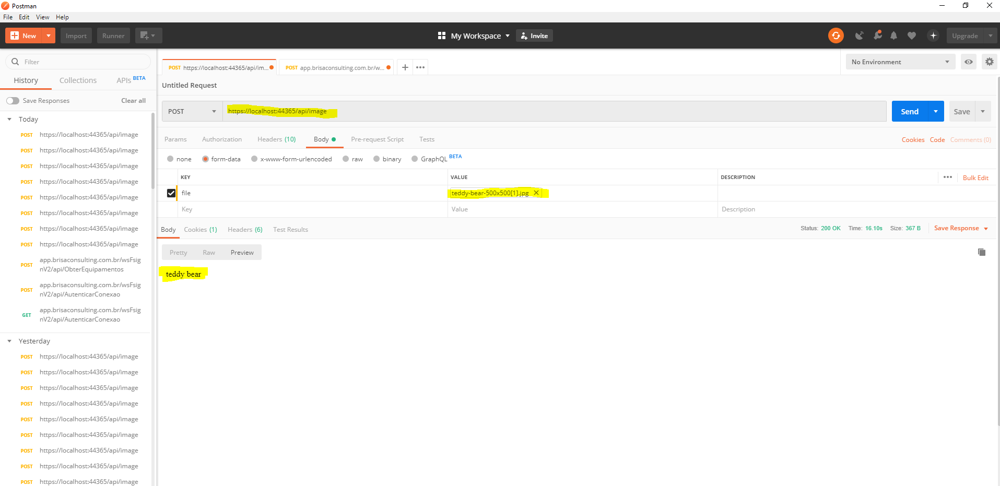

# Classificação de imagem

-modelo de classificação de imagem usando tensor flow com ML.Net

## API

o modelo esta treinado para identificar e retornar o nome de brocolis, urso de pelucia, pizza, canoas e cafeteira.

## Observação

O arquivo TensorFlowImageClassificationAPI\inputs\inception\tensorflow_inception_graph.rar foi compactado devido ao tamanho maximo de upload permitido no github, sendo nescessario descompacta-lo para o funcionamento da api.

### Screenshot 

